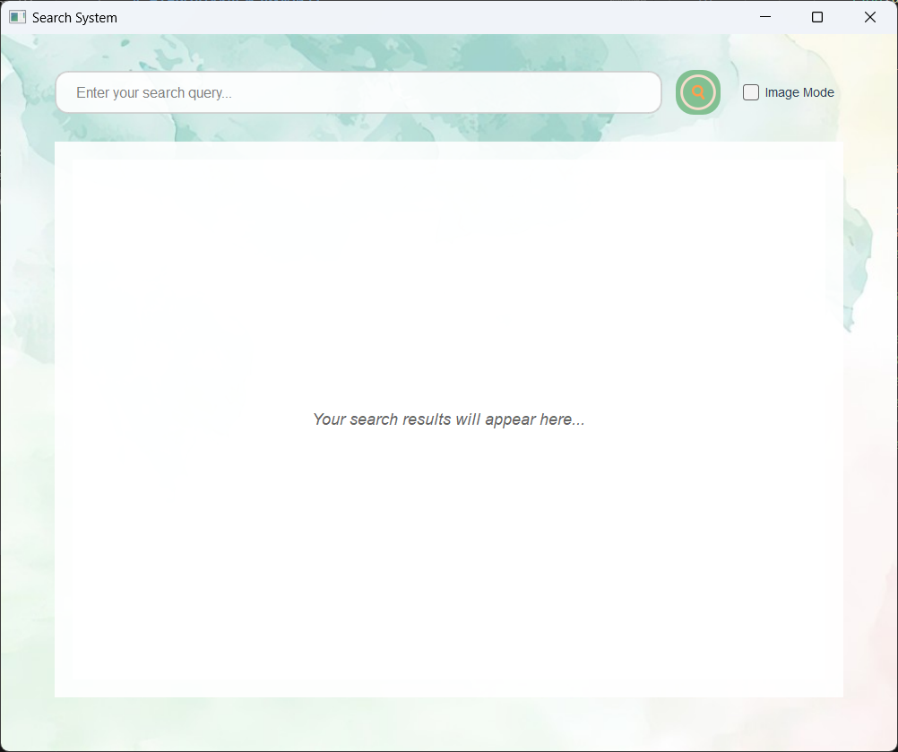

# Welcome to STORM message search system!
<div align="center">
<p align="center">
  
</p>
</div>

## Start
To start STORM, you should first install the dependencies in requirements.txt with the following command:

```bash
conda install -n your_env_name --file requirements.txt
```

Demo image datasets are put here in the form of zip, for total image datasets, see:(https://baidu.com).

You can also change the configuration through config.yaml in our projects.

## Use
To use with more flexiability, use the following command for brief usage with only text mode available and no UI:

```bash
python main.py
```

We recommend the following command for usage with text and image mode, UI are also available:

```bash
python query_window.py
```

To change dataset or inverted index, use the following command:

```bash
python buildindex.py
```

## Contact
Hope this project will do a little help in the development of information retrieval systems, if contact is needed, please send mail to: yangxiao@bupt.edu.cn. 
