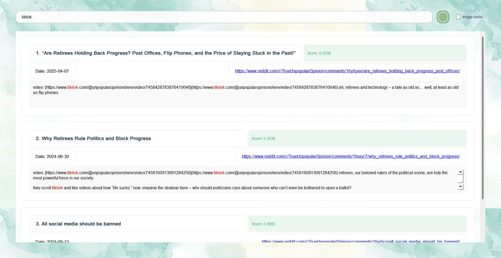
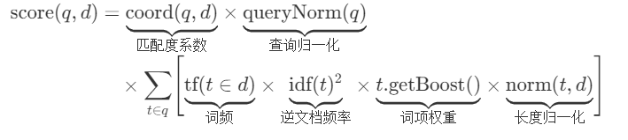
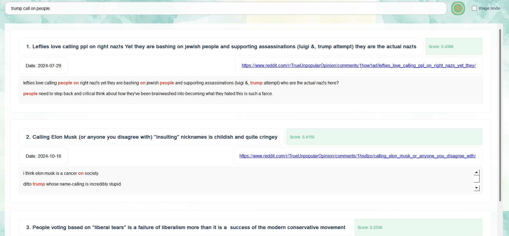
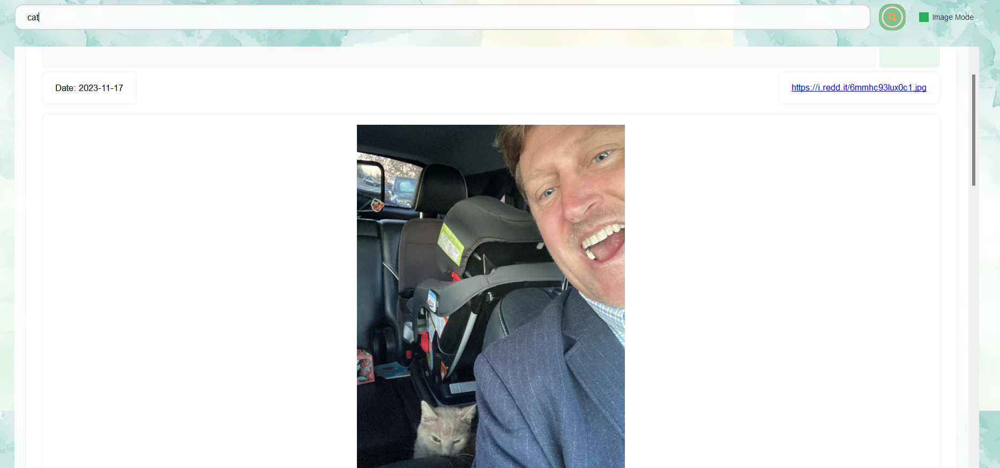
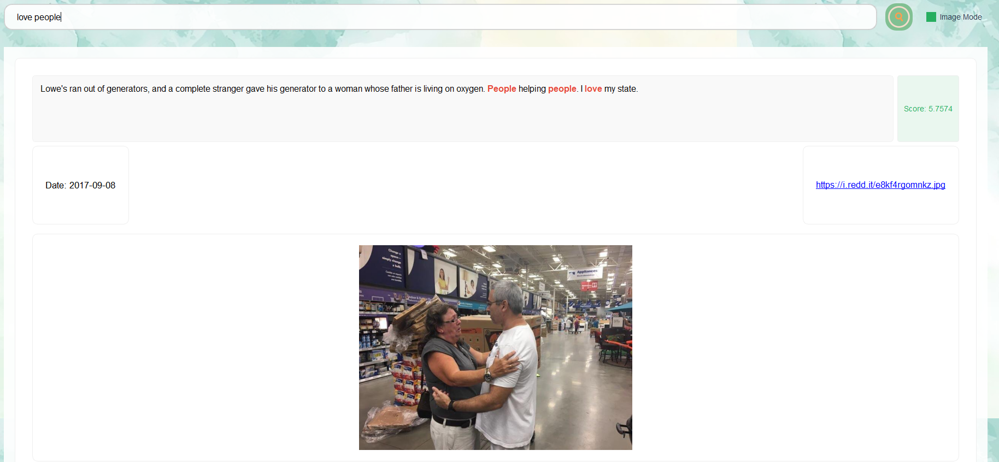

# STORM信息检索系统报告
<center>2022211301班  杨枭   钱文滔   苏柏闻</center>

&emsp;&emsp;我们实现了要求的信息检索系统，并将其命名为**STORM**（飓风信息检索系统），系统前端UI友好，支持查找高亮，支持词干提取，数据丰富，鲁棒性强，同时实现了多模态信息检索。

## 作业要求
&emsp;&emsp;基本要求：设计并实现一个信息检索系统，中、英文皆可，数据源可以自选，数据通过开源的网络爬虫获取，规模不低于100篇文档，进行本地存储。中文可以分词（可用开源代码），也可以不分词，直接使用字作为基本单元。英文可以直接通过空格分隔。构建基本的倒排索引文件。实现基本的向量空间检索模型的匹配算法。用户查询输入为自然语言字串，查询结果输出按相关度从大到小排序，列出相关度、文档题目、主要匹配内容、URL、文档日期等信息。最好能对检索结果的准确率进行人工评价。界面不做强制要求，可以是命令行，也可以是可操作的界面。提交作业报告和源代码。

&emsp;&emsp;扩展要求：鼓励有兴趣和有能力的同学积极尝试多媒体信息检索以及优化各模块算法，也可关注各类相关竞赛。自主开展相关文献调研与分析，完成算法评估、优化、论证创新点的过程。

## 系统实现
### 数据源
&emsp;&emsp;我们未选择现有数据集，而是重新通过爬虫实现reddit上帖子的爬取，我们选择reddit帖子集合中TrueOpinion板块部分热帖共计**810**篇，部分数据参考如下：

我们爬虫的部分代码如下：
```python
import praw
import jsonlines
import requests
import time
import os
import urllib.request
print("系统级代理配置:", urllib.request.getproxies())
print("当前代理环境变量:", os.environ.get('https_proxy'))
reddit_read_only = praw.Reddit(
    client_id="2VYEF43NKc5Fgy4tyVrpRA",
    client_secret="5G89AoMDmT4tkHC2e1i2M316YM_Sjg",
    user_agent="simonsshoot",  # 按规范格式修改
    proxies={
        "http": "http://127.0.0.1:7890",
        "https": "http://127.0.0.1:7890"
    }
)

subreddit = reddit_read_only.subreddit("pics")
count=0
# 打开 jsonl 文件以写入数据
with jsonlines.open("urls.jsonl", mode="w") as writer:
    # 遍历热帖并写入 URL
    for post in subreddit.top(limit=1):
        count+=1
        print("start^")
        if count%40==0:
            time.sleep(3)
            print("sleep 3s")
        data = {
            "title": post.title,  # 帖子标题
            "url": post.url       # 帖子详细 URL
        }
        print("fetch post: ",post.title)
        writer.write(data)  # 写入 JSONL 文件

print("爬取完成，数据已写入文件中。")
```
### 前端UI设计
&emsp;&emsp;为了进一步方便用户使用我们的信息检索系统，我们通过PyQt5实现了一个**可以交互的UI界面**，参考如下：

前端代码主要在query_window.py中，简单的流程为首先搭建整体的布局，如：
```python
def initUI(self):
        self.setWindowTitle('Search System')
        self.setGeometry(300, 300, 1000, 800)
        
        self.set_background("pictures/background.jpg")
        
        #主容器
        main_widget = QWidget()
        main_widget.setAttribute(Qt.WA_TranslucentBackground)
        self.setCentralWidget(main_widget)
        
        #主布局
        main_layout = QVBoxLayout(main_widget)
        main_layout.setContentsMargins(60, 40, 60, 60)
        main_layout.setSpacing(30)
        
        self.setup_search_area(main_layout)
        
        #结果展示区域
        self.setup_results_area(main_layout)
        
    def set_background(self, image_path):
        palette = self.palette()
        background = QPixmap(image_path).scaled(
            self.size(), 
            Qt.KeepAspectRatioByExpanding, 
            Qt.SmoothTransformation
        )
        palette.setBrush(QPalette.Window, QBrush(background))
        self.setPalette(palette)
```
其次，为这些构件添加信号槽函数，在用户交互时执行相应的动作，如：
```
#启动搜索线程
self.search_worker = SearchWorker(self.current_scorer, query)
self.search_worker.finished.connect(self.display_results)
self.search_worker.start()
```
在完成动作函数设计后（动态函数也涉及与后端的交互），还需要前端进行结果的渲染，如show_loading和display_results等函数：
```python
    def show_loading(self):
        loading = QLabel("Searching...")
        loading.setStyleSheet("""
            QLabel {
                color: #444444;
                font-size: 16px;
            }
        """)
        loading.setAlignment(Qt.AlignCenter)
        self.results_layout.addWidget(loading)
```
### 后端模块设计
#### buildingindex.py
&emsp;&emsp;该模块主要实现了倒排索引的构建，在这里，我们考虑到查找词的不同形式可能表示同样的意思（如查询running，查询结果可包含run、runs等不同形式），我们**扩展加入了词干查找功能**并引入PorterStemmer库来实现词干提取。

&emsp;&emsp;倒排索引的构建流程为维护一个词到文档id集合的映射，对于每一个出现的词，应该记录这个词在哪些文档中出现，如：
```python
    def process_doc(self,doc_id,text):
        #文档中的词添加到倒排文件中
        terms=self._tokenize(text)
        for term in terms:
            self.inverted_index[term].add(doc_id)

    def build_from_file(self,file_path):
        with open(file_path,'r',encoding='utf-8') as f:
            for line_num,line in enumerate(f):
                try:
                    data=json.loads(line.strip())
                    doc_id=data['id']
                    text=data['article']
                    self.process_doc(doc_id,text)
                    self.tot_docs+=1
                except (KeyError,json.JSONDecodeError)as e:
                    print(f"error processing in line {line_num}: {e}")
                    continue
                except Exception as e:
                    print(f"unexpected error in line {line_num}: {e}")
                    continue
```
不仅如此，该模块中还实现了对词idf的统计以及词干提取的部分实现，详情可查看源代码，比如对于idf的计算：
$$
\begin{aligned}
\text{IDF}(t) = \frac{\log \left( \frac{N}{df(t)} \right)}{\log(b)}
\end{aligned}
$$
有对应代码实现：
```python
    def compute_idf(self,base=math.e):
        if self.tot_docs==0:
            raise ValueError("no document yet")
        idf_values={}
        for term,doc_ids in self.inverted_index.items():
            df=len(doc_ids)
            idf=math.log(self.tot_docs/df)/math.log(base)
            idf_values[term]=idf
        return idf_values
```
#### lucene.py   
&emsp;&emsp;作业二中关于匹配算法建议采用基本的向量空间检索模型，即将单词表示为向量，并通过比较余项相似度来查找，这个实现是非常简单的，如下：
```python
        def cosine_similarity_matrix(q, k):
            q_norm = F.normalize(q,dim=-1)
            k_norm = F.normalize(k,dim=-1)
            cosine_similarity = q_norm@k_norm.T
            
            return cosine_similarity
```
&emsp;&emsp;值得注意的是，这样的处理是把每个单词的查询权重简单地设为一样，即搜索“the sunshine”时，the和sunshine贡献几乎相同，这可能不合理。所以我们通过查询，**引入Lucene评分机制**，通过控制词汇的权重，使得查找更具有针对性，Lucene的评分机制如下：
<!-- $$
\begin{aligned}
\text{score}(q,d) &= \underbrace{\text{coord}(q,d)}_{\text{匹配度系数}} 
\times \underbrace{\text{queryNorm}(q)}_{\text{查询归一化}} \\
&\quad \times \sum_{t \in q} \Biggl[ 
  \underbrace{\text{tf}(t \in d)}_{\text{词频}} 
  \times \underbrace{\text{idf}(t)^2}_{\text{逆文档频率}} 
  \times \underbrace{t.\text{getBoost}()}_{\text{词项权重}} 
  \times \underbrace{\text{norm}(t,d)}_{\text{长度归一化}} 
\Biggr]
\end{aligned}
$$ -->


对应代码实现为：
```python
def compute_score(self,query):
    words = re.findall(r'\w+', query.lower())
    stems = [self.stemmer.stem(word) for word in words] if self.using_stem else words
    valid_terms = [term for term in stems if term in self.index]
    
    if not valid_terms:
        print("no valid terms found")
        return []
    sum_squared = sum((self.idf.get(term, 0.0) ** 2) for term in valid_terms)
    query_norm = 1.0 / math.sqrt(sum_squared) if sum_squared > 0 else 1.0

    contained_docs=self.query_process(query)
    doc_scores=[]
    for doc_id in contained_docs:
      tot_score=0
      matched_terms=0
      meta=self.images_meta.get(doc_id,{}) 
      length_norm = 1.0 / math.sqrt(meta.get('length', 1))
      for term in valid_terms:
        if doc_id in self.index[term]:
          tf=1
          idf=self.idf.get(term, 0.0)

          boost=1.0
          term_contrib=tf*idf*idf*boost*length_norm
          tot_score+=term_contrib
          matched_terms+=1
      coord=matched_terms/len(valid_terms) if len(valid_terms)>0 else 0.0

      final_score=coord*query_norm*tot_score
      doc_scores.append((doc_id,final_score))
      top_k=min(self.top_K,len(doc_scores))
    return sorted(doc_scores,key=lambda x:x[1],reverse=True)[:top_k]
```

#### outputs.py
&emsp;&emsp;这部分主要是对输出进行处理，根据Lucene评分的top_k结果，输出相关度、文档题目、主要匹配内容、URL、文档日期等信息，并以更为友好的前端形式呈现。

&emsp;&emsp;比如，我们在返回结果中实现了**匹配内容的高亮处理**（可以看第一张图），具体的代码基于正则表达式匹配，并对匹配内容进行html形式的加工，如下：
```python
  def _highlight_terms(self, text: str) -> str:
    if not self._query_terms:
        return text
    print(self._original_query)
    pattern = r'\b({})\b'.format('|'.join(map(re.escape, self._original_query)))
    return re.sub(pattern, 
                r'<span style="font-weight: bold; color: #e74c3c;">\1</span>', 
                text, 
                flags=re.IGNORECASE)
```

## 环境与可持续化发展思考
&emsp;&emsp;一个良好的搜索系统，首先应该是“绿色发展”的，为了实现查找内容的绿色、健康，我们可以**通过实现Lucene评分公式中t.getBoost()**，即对于绿色单词的权重，我们将其设置的更高，这样在查询中它的影响力会更大，系统也就更倾向于返回绿色化结果（这也是我们引入Lucene的原因之一）。

&emsp;&emsp;此外，我们的所有数据集均遵从开源规范和reddit数据使用协议，并通过人工校验的方式确认了数据集的无害性，这进一步保证了系统的健康使用。

&emsp;&emsp;我们将所有的代码和数据集同步开源至[Mess Search System 项目仓库](https://github.com/simonsshoot/Mess_Search_System)，并提供详细的说明（注：项目为github仓库，可能需要梯子才能访问），希望能帮助更多的人更好地理解和使用信息检索系统，为其绿色、可持续化发展贡献一份绵薄之力。

## 鲁棒性与人工评价
&emsp;&emsp;为了评估我们的系统，我们对其进行了大量的测试，包括单个单词以及多个单词组，并进行人工的准确度评价，一个示意如下：


&emsp;&emsp;搜索trump call on people，返回的帖子中均有内容和这些词有关，并包含正确的url和从大到小的top_k结果，这说明我们的系统基本符合预期。

## 多媒体信息检索
&emsp;&emsp;随着人们对多媒体信息的需求越来越强烈，我们也在探索多媒体信息检索的相关领域，我们的系统也因此实现了图片的检索，数据集同样来源于reddit的pics板块并通过爬虫获取。我们系统依赖的完整数据集包括**825**张高质量的图片（共计500MB），在version_data_large目录下，我们也提供了简单的demo数据集（21MB），在version_data目录下。
&emsp;&emsp;在config.yaml中，可以灵活地调整相关配置信息。

&emsp;&emsp;如上图所示，搜索cat并勾选图像模式，可以看到返回结果：“在我的车上发现了邻居的猫”……


## 其他创新思考
&emsp;&emsp;我们也在积极思考如何进一步提升我们的系统包括：
- **更多的模态**：除了文本和图片检索，我们计划引入视频内容分析（基于FFmpeg提取关键帧）和音频特征提取（如MFCC系数）。通过OpenCV和Librosa库实现跨模态特征融合，构建统一的多媒体索引，支持"以图搜视频"或"语音找相关文本"等复杂场景。

- **更好的搜索**：引入智能纠错机制和模糊搜索，如用户搜索"AI learing framwork"时，系统自动纠正为"AI learning framework"，这一点可以通过如Glove等库实现。

- **更优的存储**：我们在网上探索了分布式索引架构的存储机制，如采用Elasticsearch替代本地JSON存储，实现倒排索引的分片与副本机制。通过REST API支持多节点横向扩展，使数据吞吐量提升10倍以上，轻松应对百万级文档规模。

## 结果演示
&emsp;&emsp;最后给出几个查询的例子，展示我们的系统的检索效果，我们同样**提供演示视频**，在[Mess Search System 项目仓库](https://github.com/simonsshoot/Mess_Search_System)中可以找到。


